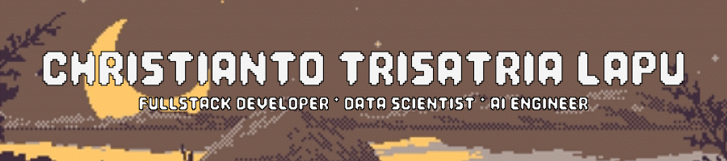

  

###

<!-- Header GIF -->

  

###

###

<h1 align="center">Glad You're Here! Let's Make This Journey Amazing. 🚀</h1>

###

<h6 align="center"><em>"Coding isn’t about what you know — it’s about what you can figure out."</em></h6>

###

<h2 align="left">About me</h2>

###

Hay! I'm Ian a Fullstack Developer, Data Science and AI enthusiast currently in my 5th semester of Informatics Engineering at Hasanuddin University, pursuing the AI specialization track and constantly energized by the challenge of turning ideas into intelligent systems.  I’m driven by end-to-end creation from building full-stack applications and uncovering insights through data, to developing and deploying AI models that solve real problems. With 5 years of experience as a video editor and motion graphic designer, I bring a distinctive, user-centered perspective to every project blending solid engineering, clear visual storytelling, and thoughtful product design.  I also currently core team of Creative Media team at Google Developer Group on Campus UNHAS, where I focus on turning complex technical ideas into compelling video content and polished motion graphics.  Looking for opportunities in Data Science, Full-Stack Development, or AI Engineering that let me blend technical depth with visual storytelling to create meaningful and accessible AI-driven products.

###
<h4 align="left">Connect With Me :</h4>

###

###

  
  
  
  
  
  

###

###

<h2 align="center">💻 I Code With :</h2>

<table>
<tr>
<td width="60%" valign="top">

<!-- Programming Languages -->
<h5>📋 Programming Languages</h5>

  
  
  
  
  
  
  
  
  

<!-- Frameworks & Tools -->
<h5>🚀 Frameworks & Tools</h5>

  
  
  
  
  
  
  
  
  
  

<!-- Development Tools -->
<h5>🛠️ Development Tools</h5>

  
  
  
  

 

</td>
<td width="40%" valign="" align="center">

<!-- Character Image -->

</td>
</tr>
</table>

###

# 📊 GitHub Stats:

 
 

---

###

###
<h4 align="center">
  
 Spotify Playing 🎧 

  

###

###
<!-- <picture>
  <source media="(prefers-color-scheme: dark)" srcset="https://raw.githubusercontent.com/Yanxe01/Yanxe01/output/pacman-contribution-graph-dark.svg">
  <source media="(prefers-color-scheme: light)" srcset="https://raw.githubusercontent.com/Yanxe01/Yanxe01/output/pacman-contribution-graph.svg">
  
</picture> -->

###

###

  

###

